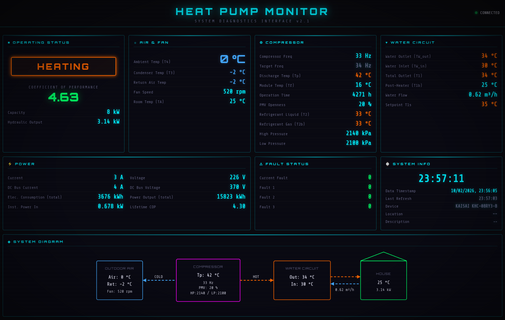

# KaisaiModbus

**Heat pump monitoring & diagnostics via Modbus (Kaisai / Midea family)**

KaisaiModbus is a Python-based Modbus client and monitoring UI for **Kaisai heat pumps (e.g. KHC-08RY3-B)** and other compatible units in the **Midea ecosystem**.

It reads live operating data directly from the heat pump using Modbus and presents it in a clean, real-time dashboard showing temperatures, compressor state, power usage, COP, faults, and more.

---

## 📸 User Interface

---

## ✨ Features

- 📡 Modbus communication with Kaisai / Midea-based heat pumps  
- 📊 Real-time monitoring of system temperatures, pressures, and flow  
- ⚡ Power usage, energy counters, and COP calculation  
- 🚨 Fault and error code decoding via JSON mapping  
- 🧩 Modular Python code, easy to extend with new registers  
- 🖥️ Modern dashboard-style UI  

---

## 🧠 Supported Devices

Tested with:

- **Kaisai KHC-08RY3-B**

Likely compatible with other **Midea-based heat pumps** using similar Modbus register layouts.

> ⚠️ Register maps may vary between models and firmware versions.

---

## 🚨 Disclaimer

This project is intended for **monitoring and diagnostics only**.
Writing to Modbus registers may damage equipment.

---

## 📜 License

MIT License
